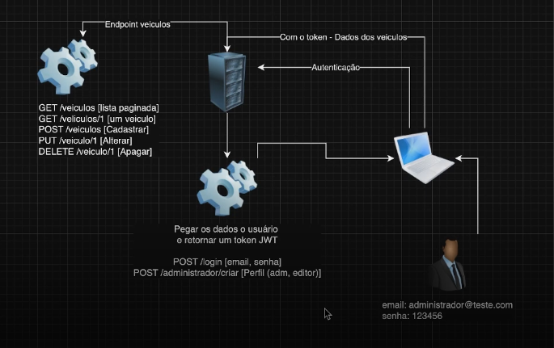

# Desafio de Projeto: Trabalhando com ASP.NET Minimals APIs

## Introdução

A proposta do desafio é montar uma API de listagem de veículos, implementando um CRUD e Endpoints para acesso e modificação de veículos.

## Proposta de Arquitetura

Fonte: Bootcamp DIO GFT .NET 7

